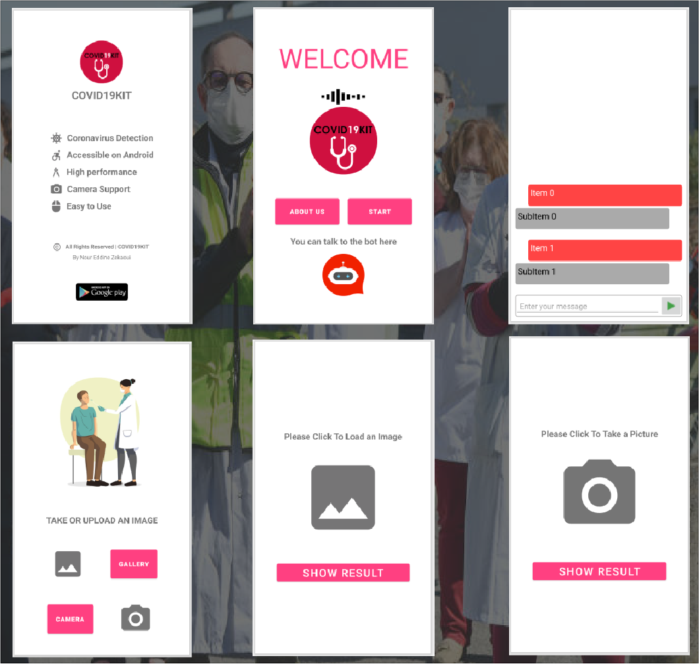

# COVID19KIT
COVID19KIT is an Android application, it can detect coronavirus in an automated way in x-ray images using the phone's camera or even by uploading an X-ray image from the gallery.

## Table of contents
- [Tech Stack](#tech-stack)
- [Screenshots](#screenshots)
- [Installation](#installation)
- [Author Infos](#author-infos)

---
### Tech Stack
* [x] Android Studio
* [x] Java
* [x] DialogFlow
* [x] TensorFlow
* [x] Google API

---

### Screenshots
 
 
---
### Installation
You can get a version of this app on your local machine, so go to your workspace directory and use the git command below:
           
    $ git clone git@github.com:zekaouinoureddine/COVID19KIT.git

---
### Author Infos
- LinkedIn: [Nour Eddine ZEKAOUI](https://www.linkedin.com/in/nour-eddine-zekaoui-ba43b1177/)
---
 
[Back To The Top](#COVID19KIT)
 
